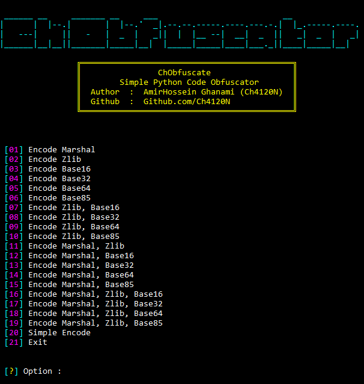

# Chobfuscate
`Chobfuscate` is a simple tool to obfuscate Python codes

## Project Porgrammer
> AmirHossein Ghanami (Ch4120N) - Ch4120ni@Gmail.com

## Made For
> This script is designed to help you obfuscate your Python code so that it is not easily readable

## 👀 Screenshot


## ⚓ Requires
> - Python 3.x
> - Python 2.x
> - colorama

## ⚙️ Installation
```bash
apt update
apt install python git -y
git clone https://github.com/Ch4120N/Chobfuscate
cd Chobfuscate
python -m pip install colorama
python Chobfuscate.py
```
### Single line installation
```bash
apt update && apt install python git -y && git clone https://github.com/Ch4120N/Chobfuscate && python -m pip install colorama && python Chobfuscate.py
```
## 💻 Supported Operating Systems
- [X] Ubuntu/Debian
- [X] Kali Linux
- [X] Arch Linux/Red Hat Linux
- [X] Windows 10/8.1/8/7
- [X] Android (Termux)

## ✨ Features

* Good Command Line Design
* Easy to use
* Very High Speed
* Advanced Error Handling
* Support for multiple obfuscation methods

## 📝️ How it Works?
You can obfuscate your code just by entering the number you want (there is nothing special to say, you can use it very simply)

## ❤️ Donation 
> BITCOIN:   bc1ql4syps7qpa3djqrxwht3g66tldyh4j7qsyjkq0
> 
> ETHEREUM:  0xfddbd535a4ad28792cbebceee3d6982d774e6d13

## ☠️ Reporting Issues

If you are facing a configuration issue or something is not working as you expected to be, please use the **Ch4120ni@Gmail.com**
